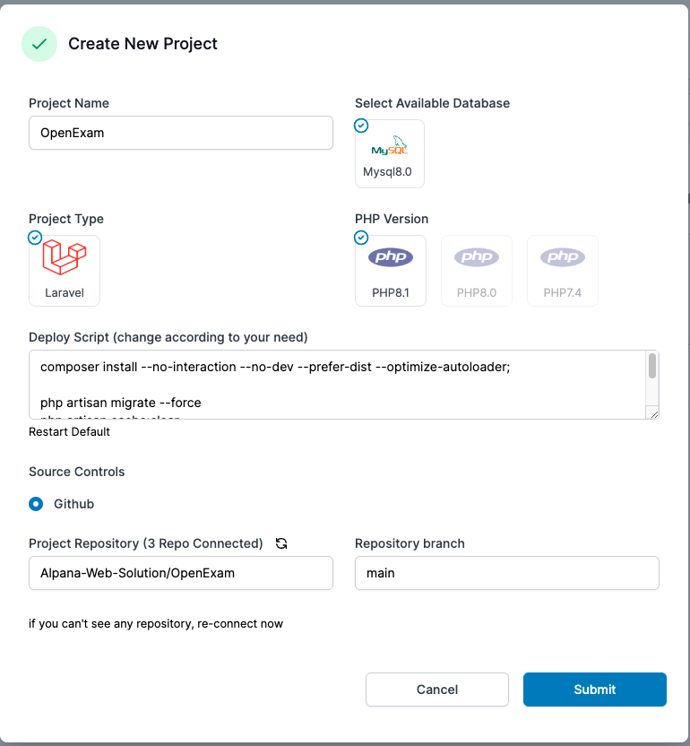
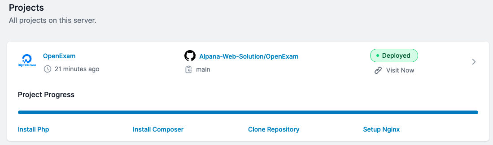
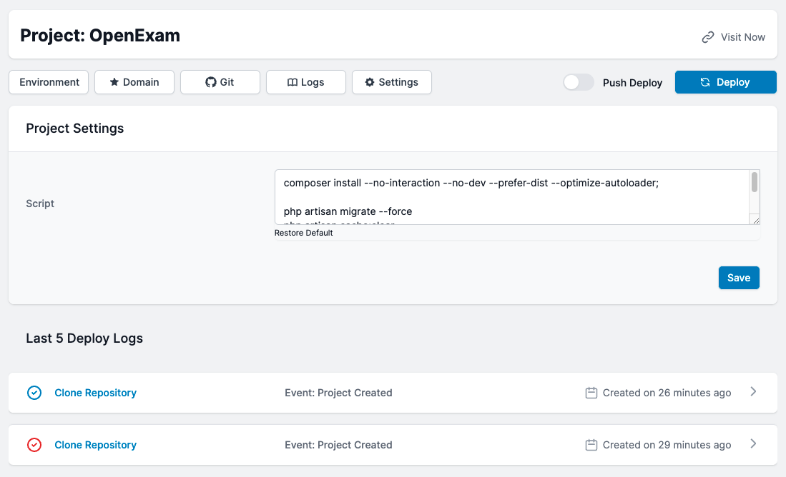
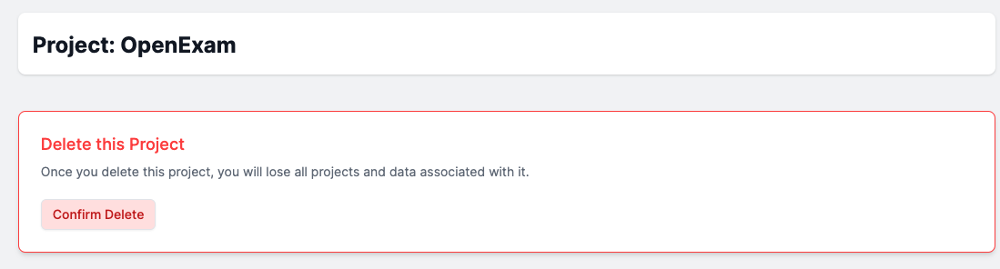

# Add Projects to your server

You currently host Laravel and Node.js app to your servers.

### Create a New Project

To begin building a project on your server, click the New Project button. Simply explain the project name, type of project, database type, and php. Now select the github repo you want to deploy and you're set to go. Now click the submit button to finish. Mizo will install everything for you instantly. 

### Project List

Once launched, you may view a list of all your projects on your server page. For further information, click on any of the projects.

### Project Details

You may view all of the project specifics right here. You can change the domain name, the environment, or the project entirely. You can also look at the last 5 deployment logs. This panel allows you to create custom project scripts.

### Delete Project

To delete a project, navigate to its details and select Settings. Inside, you'll see a delete project tab. Select and enter your project name, and that's all; your project has been successfully erased.

