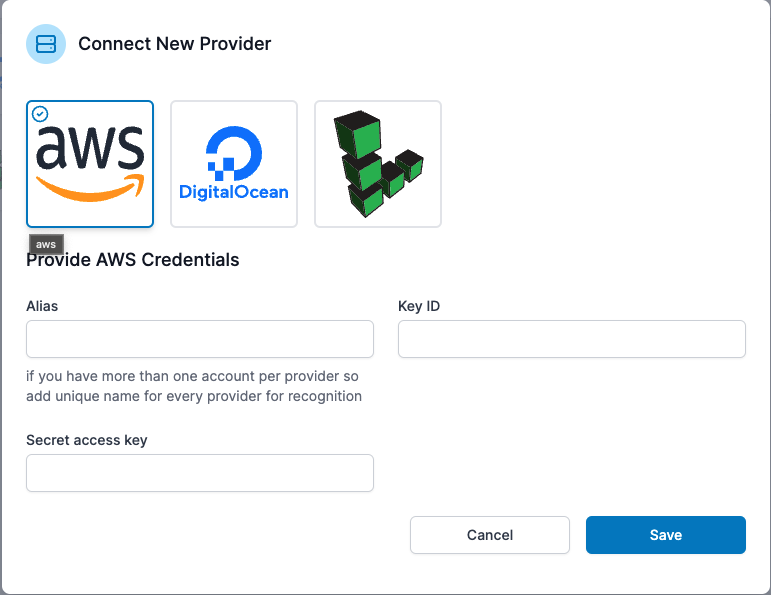

# AWS

It is fairly simple to add AWS as a provider. Login to access your dashboard; simply enter your "Key ID" and "Secret access key" and click "Save." That's it. You may now use Mezo to create a server within your AWS account. 

