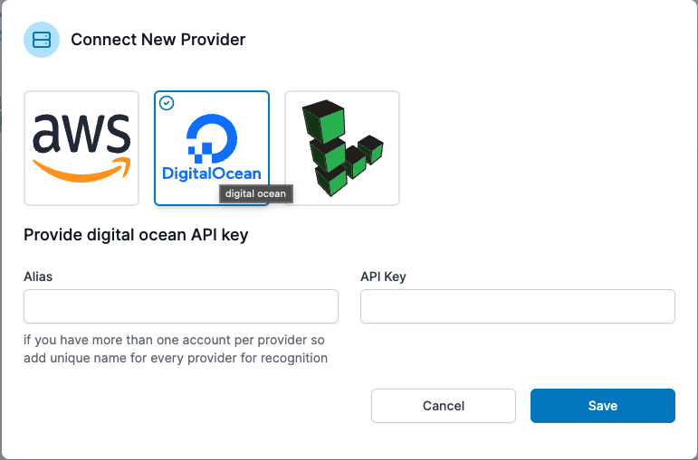

# Linode

It is fairly simple to add Linode as a provider. Login to access your dashboard; simply enter your "API Key" and "Alias" and click "Save." That's it. You may now use Mezo to create a server within your Linode account. 

