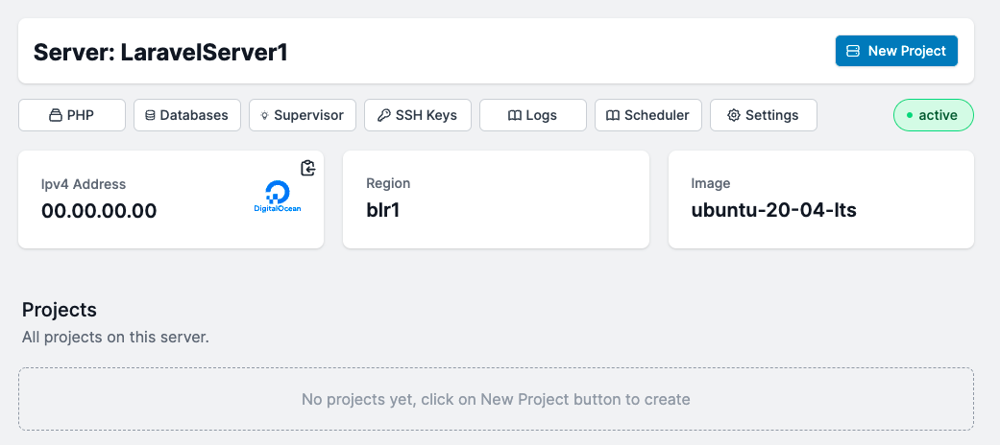

# Configure Your Servers

You can configure your server to meet the requirements of your app.

### Configure a Server

It is quite simple to manage your server in order to execute your app. You can tweak PHP and database settings, add an SSL key for passwordless login, or entirely destroy the server.

### How to select a php version?

To modify your server's default php version, select the php option. PHP versions 7.4, 8.0, and 8.1 are available.

### How to select a databse?
To modify your server's default database, select the database option. Redis, MySql 8.0 and PostgreSQL is available to use.

