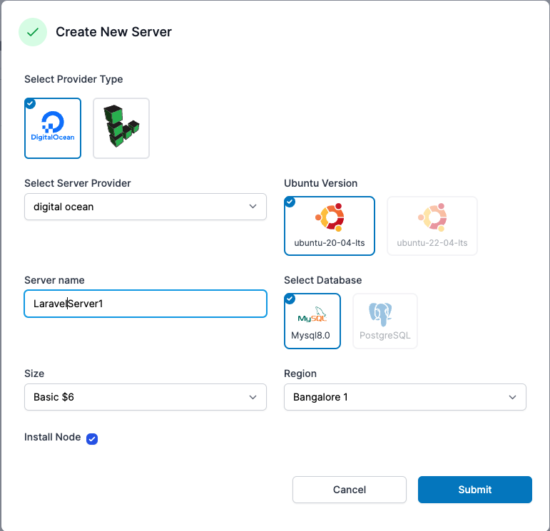
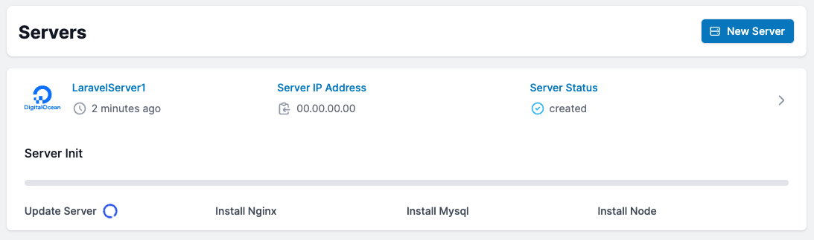
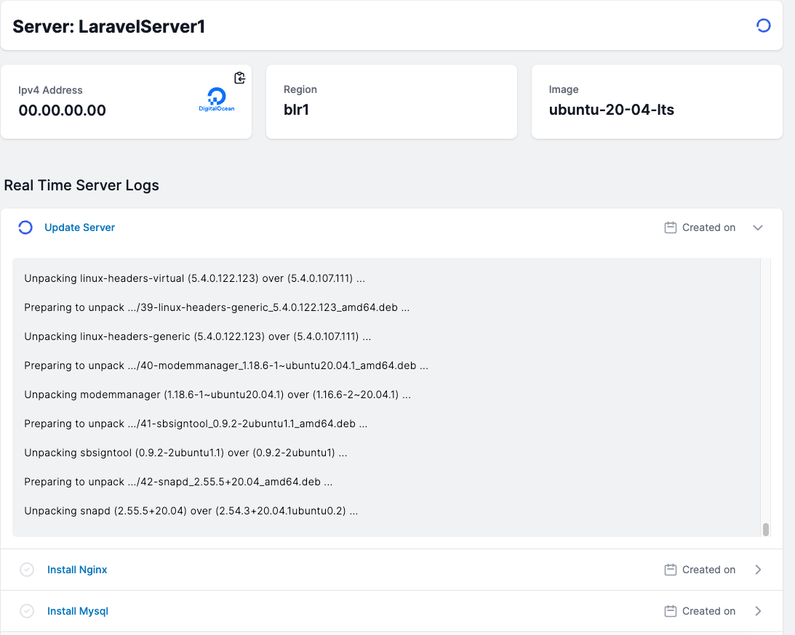

# Set Up Servers

#### You can build your server from the ground up in under 10 minutes. Here's how to configure your server using mizohub.

### Create a Server

Using mizohub to creating your server is a breeze. Simply choose your service provider account, Linux version, Database Type, a suitable name, size, and region from the drop down menus. That's all. Hit Submit and wait for your server to be ready.

### Server Details
Once built, you may see all of your server's details from the server tab.

When you click on settings, you will see all of your server's details as well as real-time data.

