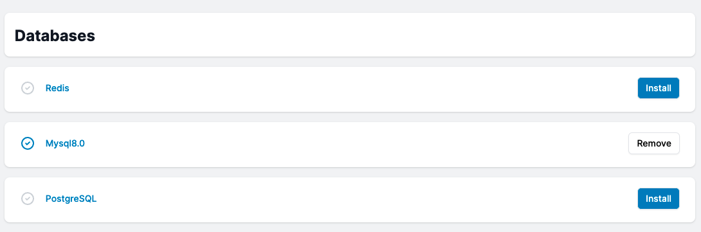
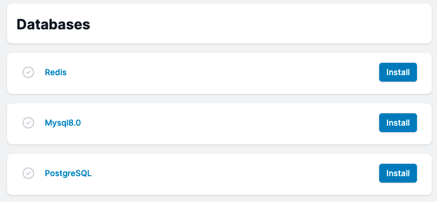
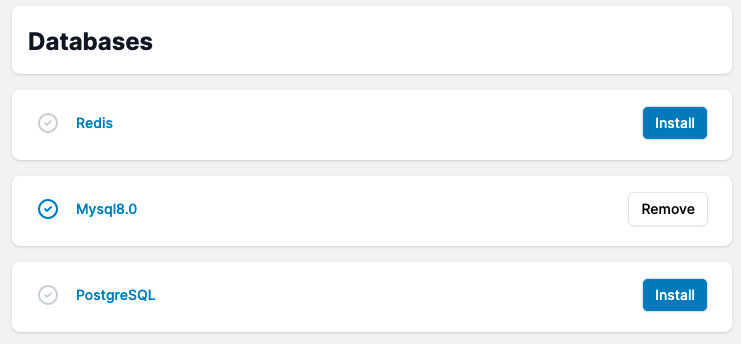
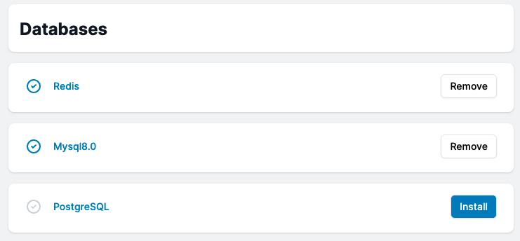
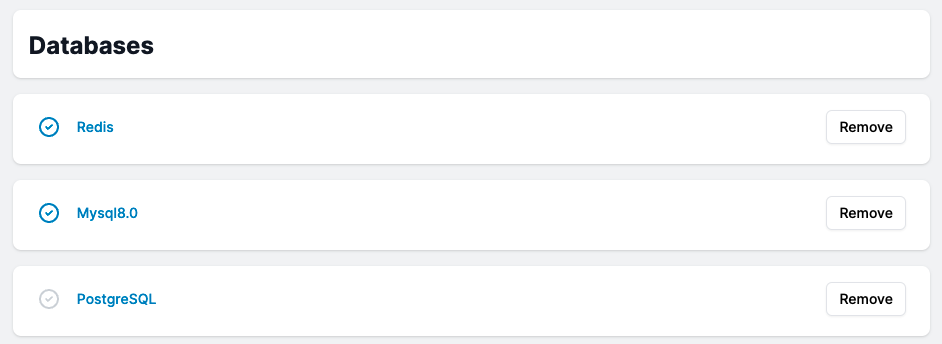

# Configure Database

Mizo makes database server setup incredibly easy and straightforward. You only need to specify the server you require for your project, and Mizo will install it with a single click. If you are setting up a project, the project wizard page is where you can find your database.

### How to select a Databse?

To modify your server's default database, select the database option. Redis, MySql 8.0 and PostgreSQL is available to use.

### How To Install MySql?

You can install MySQL by clicking the install button next to it. At this time, only version 8 of MySQL is supported. 

### How to remove MySQL?

Click the remove button next to the MySQL version to remove MySQL from the server.

### How To Install Redis

You can install Redis by clicking the install button next to it. 

### How To Uninstall Redis?

You can Uninstall Redis by clicking the remove button next to it. 

### How To Install PostgreSQL?

You can install PostgreSQL by clicking the install button next to it. 

### How To Uninstall PostgreSQL?

You can Uninstall PostgreSQL by clicking the remove button next to it. 

