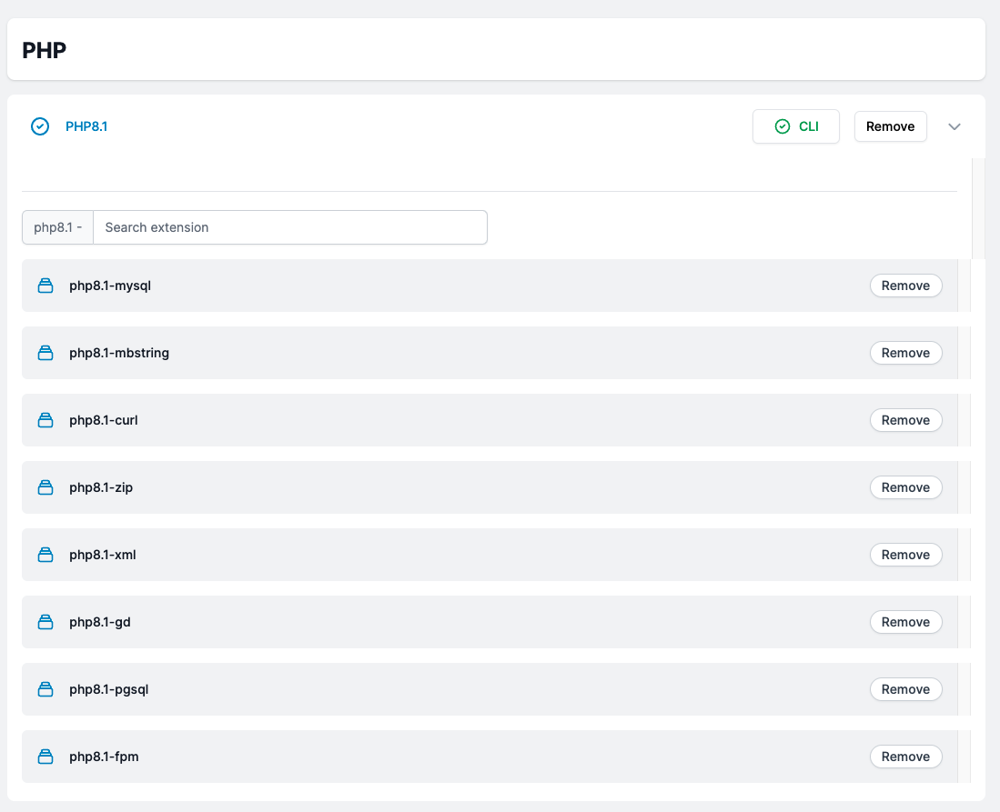

# Configure PHP

You can configure your PHP to meet the requirements of your app.

### Configure a Server

<!-- It is quite simple to manage your server in order to execute your app. You can tweak PHP and database settings, add an SSL key for passwordless login, or entirely destroy the server. -->
PHP configuration for your server is incredibly simple with mezo. Simply select PHP version and Mezo will take care of the rest. After installing your PHP version, you can change the PHP extensions Inside PHP e-version.

If you are installing a project that requires PHP to run, you do not need to install PHP separately on your server. Mizo will automatically install PHP and its extensions.

### How to select a php version?

To modify your server's default php version, select the php option. PHP versions 7.4, 8.0, and 8.1 are available.

### Add Remove PHP Extensions

You can add or remove PHP extensions as needed for your project. To update existing php extensions, go to Installed php version and click the arrow; this will display current php extensions, which you can add or remove.

