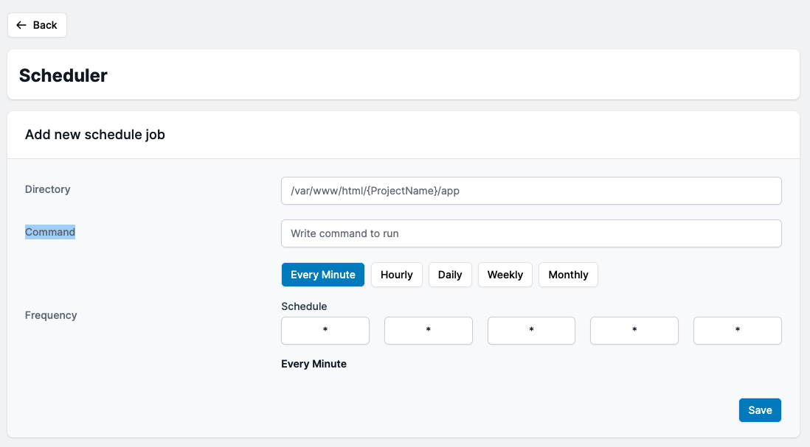

# Scheduler

You may easily configure a scheduler or "Corn Job" for your app.

Simply choose the "Directory" where your file is located, type "Command," and choose how frequently you want it to execute. Your "Corn Job" or Schedular is now complete.

