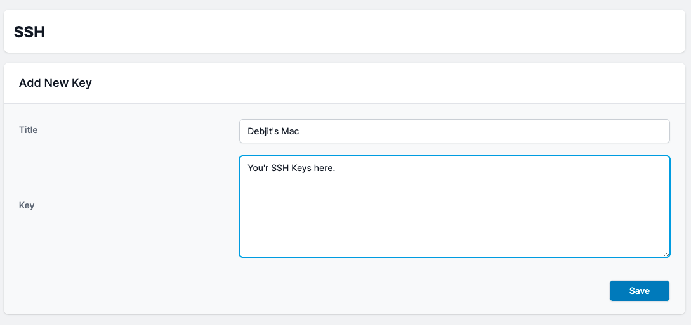
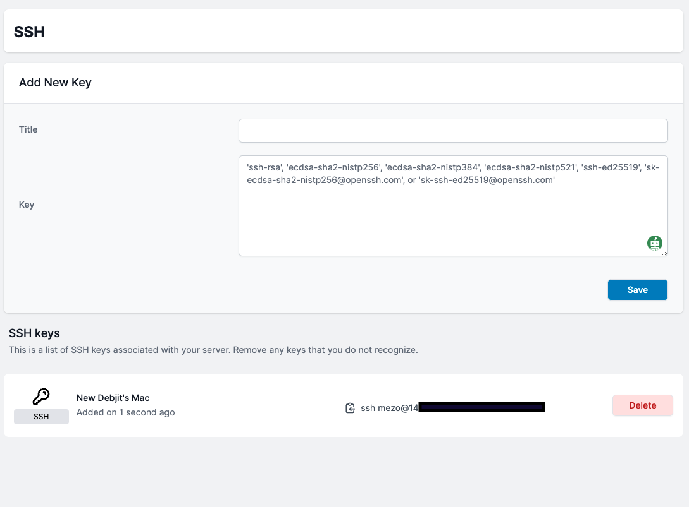

# SSH

## Generating a new SSH key

You can connect to and authenticate to a servers using the SSH protocol. With SSH keys, you can connect to server without having to enter your username and personal every time.

Learn More about [SSH here](https://docs.github.com/en/authentication/connecting-to-github-with-ssh/about-ssh), and follow this tutorials to [Generate new SSH key](https://docs.github.com/en/authentication/connecting-to-github-with-ssh/generating-a-new-ssh-key-and-adding-it-to-the-ssh-agent)

## Adding SSH Key To An Existing Servers
After you've built a server, you'll need to add your ssh keys. To add a key, navigate to your server and select ***SSH Keys***. There is an ***Add New Key*** form there where you may provide information about the ***Title*** and ***Key***

## How to connect to server using SSH?

To connect to your server use mac's own terminal, [Oh My ZSH!](https://ohmyz.sh/) or [warp](https://warp.dev). You can copy the command directly from the *** SSH Keys*** tab or you can type manually in terminal. To manually use the server use *** SSH mezo@ipaddress*** replace ipaddress wtih your servers real IP Address. Thats it you now can connect to your server without any password.

## How to remove SSH access from server?

If you want to remove the ssh key from the server, go to the ***SSH Keys*** menu, and look for the ***Delete*** button. That's all; after you destroy your ssh key, you no longer have access to your server.

